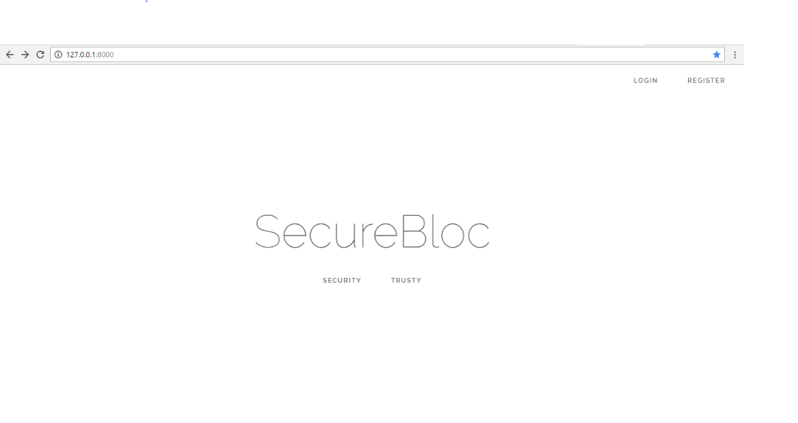
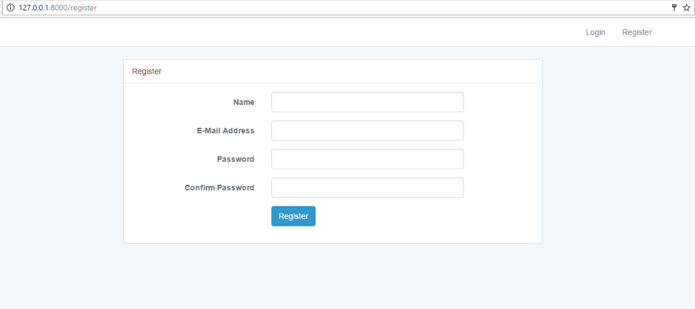
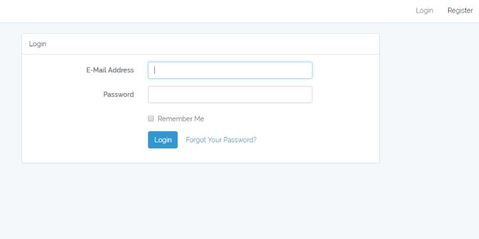
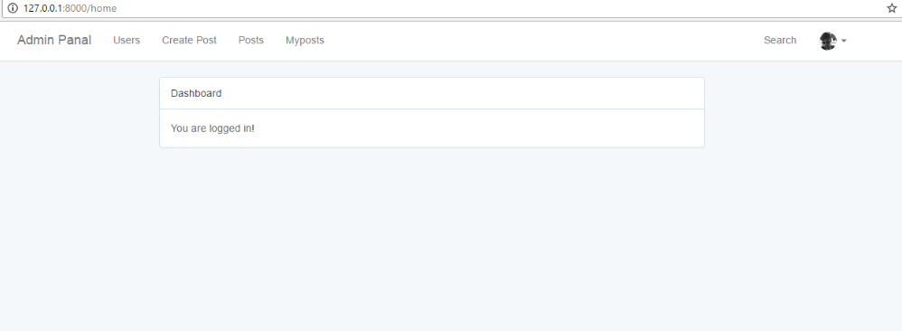
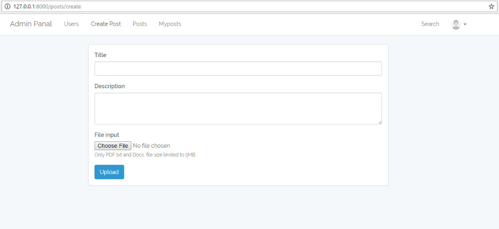
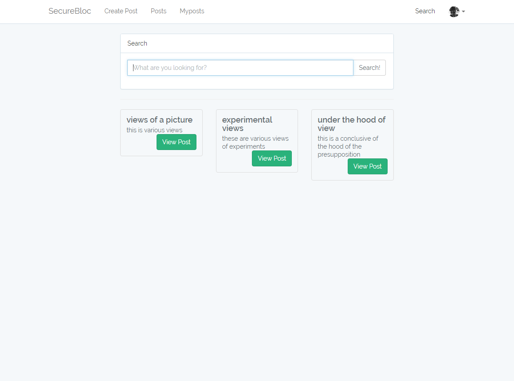

# multi_keyword_search
auth with email verification, multiple types of users, and multi-keyword search  [under development] , in the future may be 2-step verification 
For getting stared in the command line use  
  "composer install"
command  to finalize and then rename .env.example to .env and fill

Welcome

Home

login

dashbord

creating post

Search Result

